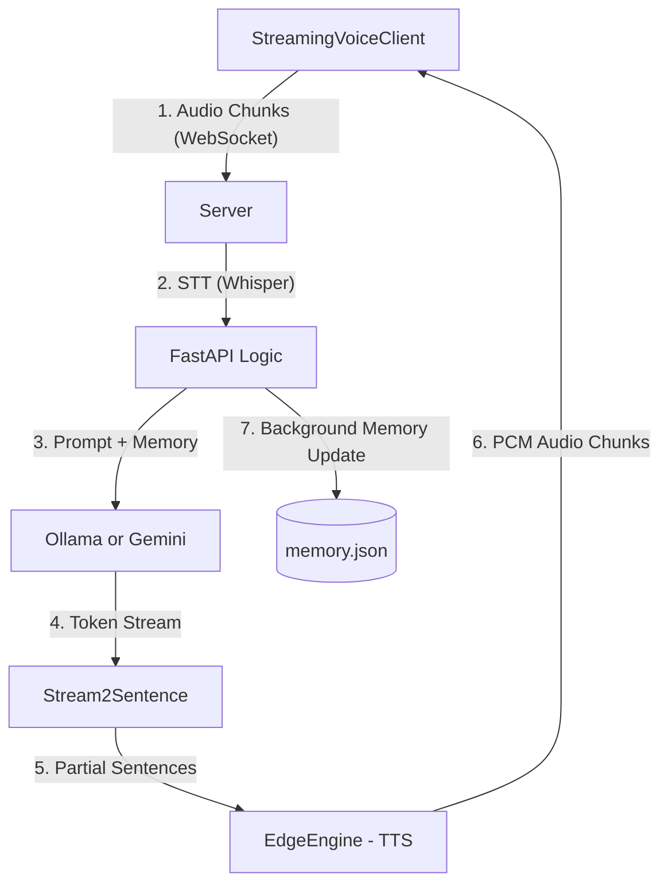

# AI Assistant System Architecture

Detailed technical overview of the `Ai_assistant-local-voice` project.

## 1. System Overview
The system is a low-latency, real-time voice assistant built on a **Client-Server Architecture**. It focuses on maximizing efficiency through streaming and persistent memory.

### Core Goals:
- **Ultra-low latency**: Real-time STT and streaming TTS for "instant" replies.
- **Persistent Intelligence**: Context-aware responses using an LLM-based memory observer.
- **Hardware Agnostic**: Optimized for both Raspberry Pi (with physical button support) and macOS.

---

## 2. Architecture Diagram

---

## 3. Technical Component Breakdown

### A. Client (`client.py`)
Multi-threaded Python application managing audio I/O:
- **Input**: Uses `pyaudio` to capture 16kHz mono audio.
- **Output**: Uses `pyaudio` to play 24kHz PCM audio received from the server.
- **Communication**: Full-duplex WebSocket connection for binary (audio) and text (metadata) transmission.
- **Interaction**: Supports both persistent recording (push-to-talk via Spacebar) and hardware-specific triggers.

### B. Server (`server.py`)
Centrally manages AI processing pipeline:
- **Framework**: `FastAPI` with WebSocket support.
- **STT**: `RealtimeSTT` (faster-whisper) processes audio chunks into text upon completion of speech.
- **LLM Context**: Supports multiple backends in `app/backends/`:
    - **Ollama**: Local processing (default: `qwen2.5-coder:3b`).
    - **Gemini**: API-based processing (default: `gemini-2.0-flash`).
    - **Groq**: High-speed API processing (default: `llama-3.3-70b-versatile`).
- **Observer Pattern**: A background task analyzes user input to extract new facts and update `memory.json`.

### C. EdgeEngine TTS (`app/engines/tts_edge.py`)
A custom high-performance TTS engine that bridges `EdgeTTS` and `RealtimeTTS`:
- **Optimization**: Instead of saving MP3 files, it streams raw audio chunks.
- **Transformation Pipeline**: 
    1. Fetches MP3 segments from `edge-tts`.
    2. Pipes them through `ffmpeg` for on-the-fly decoding.
    3. Outputs raw **PCM s16le** (24kHz) directly to the WebSocket.
- **Result**: Drastic reduction in "Time-to-First-Sound".

---

## 4. Key Optimizations

### Streaming Response Optimization
We use `stream2sentence` to buffer characters from the LLM and generate full sentences. As soon as a single sentence is ready, it is dispatched to the TTS engine. This allows the assistant to start speaking **while the rest of the response is still being generated** by the LLM.

### Low-Latency Voice Synthesis
By using raw PCM bytes over WebSocket, we bypass:
1. Disk I/O (no temp files).
2. Decoding overhead on the client side.
3. Network overhead of repetitive handshakes (single persistent connection).

### Persistent Memory (AI Observer)
The system doesn't just "chat"; it learns.
- **Observer AI**: Analyzes user input in parallel to response generation.
- **Fact Storage**: Extracts structured data (e.g., "User likes pizza") and stores it in `memory.json` with a timestamp.
- **Context Injection**: Each prompt is automatically enriched with relevant facts from storage.

---

## 5. Technology Stack
- **Languages**: Python 3.x
- **API**: FastAPI, WebSocket, Uvicorn
- **LLM**: Ollama (Local) / Google Gemini / Groq API
- **STT**: RealtimeSTT (Whisper)
- **TTS**: Edge-TTS + custom FFmpeg pipeline
- **Audio**: PyAudio, SoundDevice
